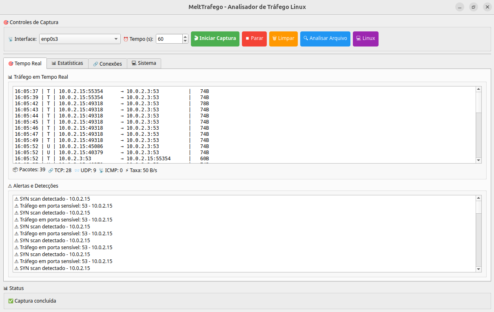
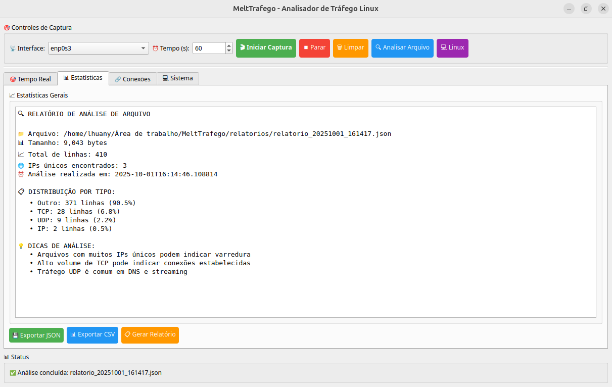
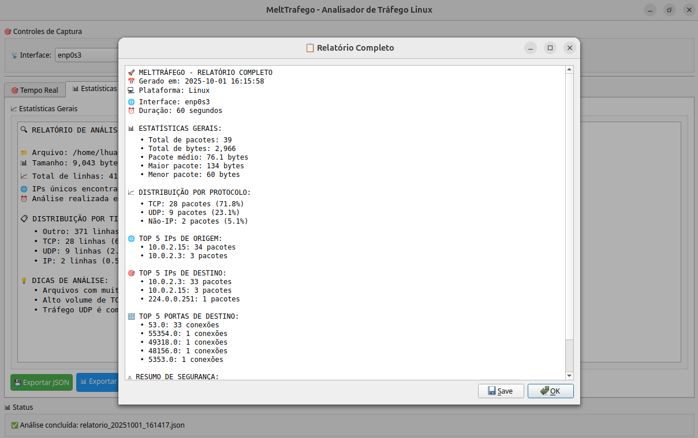
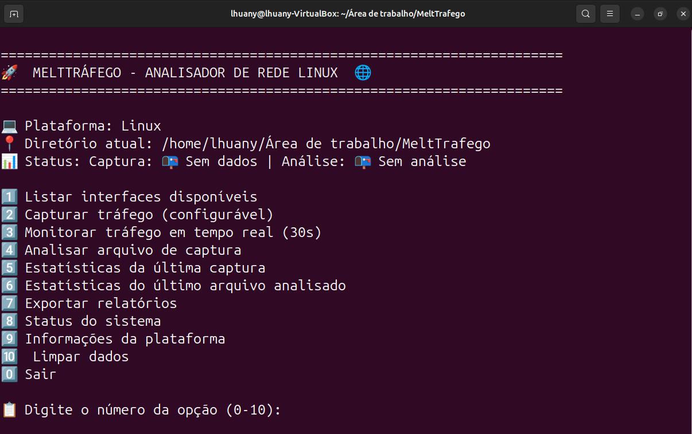

# 🌐 MeltTrafego

**Sistema de Análise e Monitoramento de Tráfego de Rede**

[](https://python.org)
[](https://github.com)
[](LICENSE)

## 📋 Índice

- [✨ Funcionalidades](#-funcionalidades)
- [🚀 Instalação Rápida](#-instalação-rápida)
- [🎯 Como Usar](#-como-usar)
- [🖥️ Interface Gráfica](#️-interface-gráfica)
- [⌨️ Linha de Comando](#️-linha-de-comando)
- [📊 Exemplos de Uso](#-exemplos-de-uso)
- [🔧 Configuração](#-configuração)
- [🐛 Solução de Problemas](#-solução-de-problemas)
- [📄 Licença](#-licença)

## ✨ Funcionalidades

### 🔍 **Captura de Tráfego**
- ✅ Captura em tempo real em múltiplas interfaces  
- ✅ Suporte a Windows (Npcap) e Linux (tcpdump)  
- ✅ Filtros IP personalizáveis  
- ✅ Progresso visual em tempo real  

### 📊 **Análise Inteligente**
- 🎯 Detecção de Port Scans com múltiplos algoritmos  
- 📈 Análise temporal e comportamental  
- 🔢 Estatísticas detalhadas por IP  
- ⚠️ Sistema de alertas com níveis de severidade  

### 💾 **Exportação e Relatórios**
- 📄 Múltiplos formatos (CSV, JSON)  
- 📊 Relatórios detalhados com métricas  
- 🎨 Visualização de dados intuitiva  
- 📈 Gráficos e estatísticas visuais  

### 🎨 **Interfaces**
- 🖥️ **GUI Moderna** - Interface gráfica intuitiva  
- ⌨️ **CLI Poderosa** - Linha de comando para automação  
- 🔧 **API Flexível** - Núcleo modular para desenvolvedores  

## 📁 Estrutura do Projeto

```
MeltTrafego/
├── relatorios/ # Diretório central para capturas e relatórios
├── assets/ # Recursos da GUI
├── melt_core.py # Núcleo do sistema
├── melt_cli.py # Interface linha de comando
├── melt_gui.py # Interface gráfica
├── config.py # Configurações
├── requirements.txt # Dependências
├── setup.py # Configuração do ambiente Python
├── install.bat # Instalador Windows
├── install.sh # Instalador Linux
└── README.md # Documentação
```

## 🚀 Instalação Rápida

### Pré-requisitos
- **Python 3.6 ou superior**
- **Windows, Linux ou macOS**
- **Permissões de administrador/rede**

### 📥 Instalação Automática

```bash
# Clone o repositório
git clone https://github.com/seu-usuario/melttrafego.git
cd melttrafego

# Linux
chmod +x install.sh
./install.sh
# ou no Windows
install.bat
```

### 📦 Instalação Manual

```bash
# 1. Instalar dependências Python
pip install -r requirements.txt

# 2. Configurar dependências do sistema
# Ver seção "Configuração por Plataforma"
```

## 🎯 Como Usar

### 🖥️ Interface Gráfica (Recomendado para Iniciantes)
```bash
python3 melt_gui.py
```

#### Fluxo de trabalho:
- **🎯 Captura → Selecione interface e tempo**  
- **📊 Análise → Configure parâmetros e analise**  
- **📈 Resultados → Veja estatísticas e alertas**  
- **💾 Exporte → Salve relatórios em CSV/JSON**  

### ⌨️ Modo Cli Interativo
```bash
python3 melt_cli.py --interativo
```

### ⌨️ Linha de Comando (Para Automação)

```bash
# Capturar tráfego
python melt_cli.py capturar -i eth0 -t 60

# Analisar arquivo existente
python melt_cli.py analisar trafego.txt -o relatorio.csv

# Modo completo (captura + análise)
python melt_cli.py completo -i any -t 30 --formato json

# Ver ajuda
python melt_cli.py --help
```

## 📊 Exemplos de Uso

- **Exemplo 1: Monitoramento Básico**
```bash
# Capturar 2 minutos de tráfego e gerar relatório
python melt_cli.py completo -i wlan0 -t 120 -o relatorio_diario.csv
```

- **Exemplo 2: Análise de Arquivo Existente**
```bash
# Analisar captura do Wireshark
python melt_cli.py analisar captura_wireshark.txt --limite-portas 5
```

- **Exemplo 3: Monitoramento Contínuo (Linux)**
```bash
# Script para monitoramento contínuo
while true; do
    python melt_cli.py completo -i eth0 -t 300 -o monitor_$(date +%H%M).csv
    sleep 60
done
```

## 🔧 Configuração

### ⚙️ Configuração por Plataforma

- **🐧 Linux**
```bash
# Instalar tcpdump
sudo apt update && sudo apt install tcpdump
# ou
sudo yum install tcpdump

# Configurar permissões
sudo usermod -aG wireshark $USER
# Reinicie a sessão após este comando
```

- **🪟 Windows**
```bash
# Instalar WinPcap/Npcap (obrigatório)
# Download: https://npcap.com/#download

# Instalar com WinPcap API compatível
pip install pypcap
# ou
pip install python-pcap
```

## 🔍 Configurações de Análise

#### Edite `config.py` para personalizar:

```python
# Janela temporal para detecção (segundos)
JANELA_TEMPO = 60

# Limite de portas para detecção de scan
LIMITE_PORTAS = 10

# Interface de rede padrão
INTERFACE_PADRAO = "any"  # Linux/macOS
# INTERFACE_PADRAO = "0"   # Windows (número da interface)

# Tempo padrão de captura (segundos)
TEMPO_CAPTURA_PADRAO = 60
```

## 🐛 Solução de Problemas

### ❌ Problemas Comuns

- **"tcpdump não encontrado" (Linux/macOS)**  
Solução: Instalar tcpdump  
```bash
sudo apt install tcpdump  # Debian/Ubuntu
sudo yum install tcpdump  # CentOS/RHEL
brew install tcpdump      # macOS
```

- **"Nenhuma interface encontrada" (Windows)**  
✅ Instale o Npcap  
✅ Execute como Administrador  
✅ Verifique se o Npcap está ativo  

- **"Permissão negada" (Linux)**  
#### Solução 1: Executar com sudo  
```bash
sudo python melt_cli.py capturar
```

#### Solução 2: Adicionar usuário ao grupo wireshark  
```bash
sudo usermod -aG wireshark $USER
# Faça logout e login novamente
```

### 🔍 Diagnóstico

```bash
# Testar captura básica
python -c "from melt_core import MeltTrafegoCore; m = MeltTrafegoCore(); print('Sistema OK')"

# Listar interfaces disponíveis
python melt_cli.py interfaces

# Testar captura rápida
python melt_cli.py capturar -t 5 -i any
```

## 📷 Imagens da Aplicação

> 💡 *Demonstrativo do MeltTrafego - Versão GUI*









> 💡 *Demonstrativo do MeltTrafego - Versão CLI*



## 🙋‍♀️ Autoria

Desenvolvido por: **Lhuany Motta** [🔗 GitHub](https://github.com/LhuanyMotta)  
Versão: 1.0  

## 📄 Licença

Este projeto está sob a licença **MIT**.